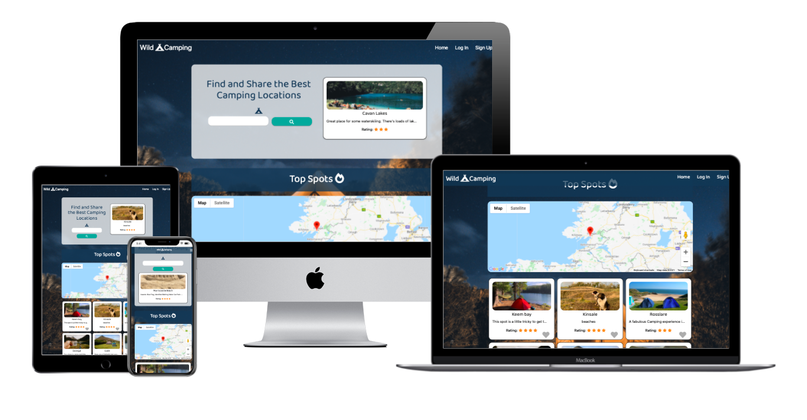

[![homepage][1]][2]

[1]:  assets/images/<logoimage>
[2]:  https://raymondkeogh.github.io/wildcamping/ "Redirect to homepage"

**WildCamping Website**
==================
Table of contents:
-----------------

 - [Description](#description)
 - [User Experience](#user-experience)
     - User Stories
     - Strategy
     - Scope
     - Structure
     - Skeleton
     - Surface
 - [Technologies](#technologies)
 - [Testing](#testing)
     - Acceptance Criteria
     - Browser Compatibility
     - OS Compatibility
     - Devices Compatibility
     - W3 HTML Validation
     - W3 CSS Validation 
     - CSS Lint Validation 
     - JSHint Validation
     - Python PEP8 Validation
     - Lighthouse Performance Test
     - Regression Testing
     - User Testing
     - Bugs
 - [Deployment](#deployment)
 - [Credits](#credits)
     - Code Used
     - Content
     - Acknowledgements

Description
-----------

WildCamping is a camp search website allowing users to search, create accounts, add locations and favourite their own spots

The live site can be viewed [here](https://raymondkeogh.github.io/wildcamping/).

User Experience
--------------------

----------

**USER STORIES**

----------

**External User Goal:  (In order of priority):**

 1. As an external user I want to find good camping locations.
 2. As an external user I want to share information on a good camping location.
 3. As an external user I create a collection of my favourite camping locations.

 Users make use of the site to share their own data with the community, and benefit from having convenient access to the data provided by all other members.
The site owner advances their own goals by providing this functionality, potentially by being a regular user themselves. The site owner might also benefit from the collection of the dataset as a whole.

**Site Owner Goal:**

 1. As a site owner I want create a knowledge bank of good camping locations

The mockup for this site was done on Balsamiq Wireframes 
and can be viewed below 

- [Desktop Homepage](static/images/wireframes/index_page.png).  
- [Profile_Page](static/images/wireframes/profile_page.png).  
- [Add_Location Page](static/images/wireframes/user_location.png).  
- [Search_Results_Page](static/images/wireframes/add_location_mobile.png).  
- [Search_Results_Page](static/images/wireframes/add_location_tablet.png). 

The full selection of wireframes can be viewed in PDF for [here](static/images/wireframes/wild_camping_wireframes)

----------

**STRATEGY**

--------

 - **Focus:**  
    The focus of this project will the search functionality, creating a simple and intuitive way to find, store and share camping locations. 

 - **Definition:**  
    The site will user populated database of camping locations with descriptions and ratings. 

 - **Value:**   
    This site allows users to explore new opportunities in wild camping, share their own camping knowledge and procure their own list of favourite locations.

----------

**SCOPE**

----------

**Features:** 

- **Navigation menu** – The navigation menu will offer users a number of site locations depending on their user access. 

- **Search Bar** – Search bar to query the database on camping locations.

- **Profile Page** – Displays user profile bio and saved locations.

**STRUCTURE**

----------

1.	The spash page of Wild Camping will disiplay a random card selection of some of the locations in the database. Scrolling down will review a map with markers to these locations. There will be a selection 6 cards below this with location pictures and previews of the descriptions. The search bar will be at the top of the page and a search button
    - As an external user I want to find good camping locations.
    - As an external user I want to share information on a good camping location.

2. The Menu will display if not logged in "Home", "Login" and "SignUp" and if logged in will display "Add Location", "Profile" "Home and "Logout"

3. The Profile page will Be broken into three sections. A profile card with some stats about the users activity. A section for posts that the user has created and section with posts that the user has liked. 
    - As an external user I create a collection of my favourite camping locations.

4. The View location page will be a simple card displaying the Name, Description, Rating, Location and Picture of the campsite. This card will display a like button to logged in users and edit or delete to the user who created the post.

5. The Add Location page will have a simple form with fields for Name and Description, a star rating selection area, a map to search for the location and drop a pin, a button to upload a photo and a submit button. 
    - As a site owner I want create a knowledge bank of good camping locations

----------

**SURFACE**

----------

**Colours:** 
    - I have got gone for muted colours with this site. I used the nighttime image of the campsite used in the background for inspiration. The dark blue or navy colours evoke the atmospheric feeling of being under the night sky. 
**Typography:** 

    -  I chose the 'Baloo Tammudu 2' as the main font for its soft lines. 'Roboto' is the backup font, not so soft but similar in structure. 

**Effects:**

 -  

**Imagery:** 

 - The imagery on the site is quite simple, using the nighttime image of campsite as the background reinforces the sites function. 

**Deviations from design:**

- There were minor layout deviations from the original design and the homepage was redesigned to include more information for the user. 

Technologies
----------------

 - [**HTML5**](https://en.wikipedia.org/wiki/HTML5) –  to create the websites main structures
 - [**CSS3**](https://en.wikipedia.org/wiki/CSS) – to style the components created with HTML and
   create the desired effects described in the ‘Surface’ section.
 - [**Materialize**](https://materializecss.com/) – to create responsive elements on the page.
 - [**FontAwesome**](https://fontawesome.com/)  - icons used throughout the site.
 - [**Google Fonts**](https://fonts.google.com/) – Imported fonts.
 - [**GitPod**](https://gitpod.io/) – IDE used for working on my code
 - [**GitHub**](https://github.com/) – Used for hosting the files used for the website.
 - [**Git**](https://git-scm.com/) – Version control used to track changes, commit and push code to
   Github.
 - [**Python**](https://www.python.org/download/releases/3.0/)
 - [**Flask**](https://flask.palletsprojects.com/en/2.0.x/)
 - [**Javascript**](https://www.javascript.com/)
 - [**Flask**](https://flask.palletsprojects.com/en/2.0.x/)
 - [**Lighthouse**](https://developers.google.com/web/tools/lighthouse) - Website performance testing utility found in Chrome DevTools. 
 - [**DevTools**](https://developers.google.com/web/tools/chrome-devtools) - I used Chrome DevTools throughout the development of the site to modify elements on the screen live, testing screen responsiveness, debugging code and access to the [Lighthouse](https://developers.google.com/web/tools/lighthouse) utility. 
 - [**StackEdit**](https://stackedit.io/editor) Used to help in the creation of this Readme file.
 - [**Pixlr**](https://pixlr.com/e/) - used for editing images for the website and creating png files.   
 - [**W3 HTML Validation**](https://validator.w3.org/) - Online HTML validation tool. 
 - [**W3 CSS Validation**](https://jigsaw.w3.org/css-validator/) - Online CSS validation tool.
 - **Gitpod extensions:**
     - Auto Close Tag
     - Bracket Pair Colorizer
     - Code Spellchecker
     - Prettier - Code Formatter
     - Indent-Rainbow
 - [**Techsini**](http://techsini.com/multi-mockup/index.php) - I used this website to create a multi mockup of the live website display at the head of my Readme file. 
 - [**Brackets**](http://brackets.io/) - Local IDE.
 - [**Autoprefixer**](https://autoprefixer.github.io/) - Parses CSS and adds vendor prefixes.
 - [**Google mobile-friendly Test**](https://search.google.com/test/mobile-friendly?id=PM7sy6dG9tEXLsvHooNW6Q) - Tests for mobile compatibility. 
 - [**Webpagetest.org**](https://www.webpagetest.org/result/201121_DiAZ_f0035ae75885410bc1ba7907017673b9/) I used this website to run speed tests from multiple locations around the globe using real browsers (IE and Chrome) and at real consumer connection speeds.
 - [**Xcode simulator**](https://developer.apple.com/documentation/xcode) - suite of tools used for build or testing apps for Apple platform.
 - [**BeautifyTools Javascript Validator**](https://beautifytools.com/javascript-validator.php) - Online Javascript validation tool. 
 - [**JSHint Validation**](https://jshint.com/) - Online Javascript validation tool.  
 - <****>

Testing
-------

----
**Acceptance Criteria:**

1. All links on the website must connect to the correct location.
2. All images and elements on website must load correctly.
3. All fallback fonts must work visually should the first choice fonts be unavailable.
4. All elements on the website must be responsive, resizing for different screen sizes and maintaining their integrity with no overlapping.
5. All external links direct to the correct website.
6. The website loads correctly and functions on Chrome, Internet Explorer, Safari and Firefox browsers.
7. The website performs as required as outlined in User Stories for external users and the site owner.

All testing is documented and can be viewed in the following formats. [Mac Numbers](assets/testing/<****>.numbers), [Excel](assets/testing/<****>.xlsx) and [PDF](assets/testing/<****>.pdf).

----
**Browser Compatibility**

<****>

**OS Compatibility** 

The OS used during testing were: 
- <****>

----
**Device Compatibility** 

The devices used during testing were: 
- <****>

----
**W3 HTML Validation** 

HTML Validation with [https://validator.w3.org/](https://validator.w3.org/).

<****>

----
**W3C CSS Validation** 

CSS validation with [https://jigsaw.w3.org/css-validator/](https://jigsaw.w3.org/css-validator/)

<****>

----
**CSS Lint Validation**

CSS also validated via http://csslint.net/

<****>

----
**BeautifyTools Javascript Validation** 

<***>

----
**JSHint Validation**

<****>

----
**Lighthouse Performance Test** 

The performance of the site on Lighthouse can be viewed [here](assets/testing/<****>.pdf). 

----
**Regression Testing**

<****> 

----
**User Testing**

<****>

----
**Bugs**

+ **Bug:** <****>  
**Fix:** <****>

Deployment
----------

<****>

Credits
-------

**Code used**

<****>

**Content**

<****>

**Acknowledgements**

